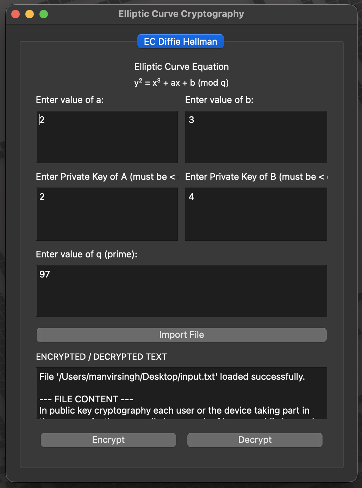
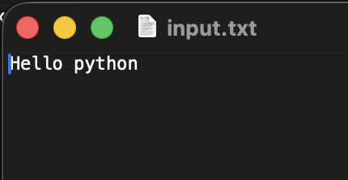
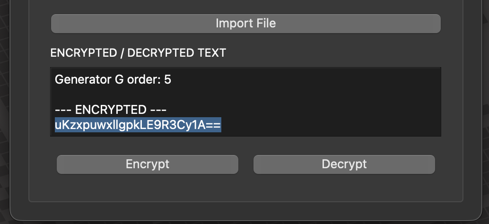
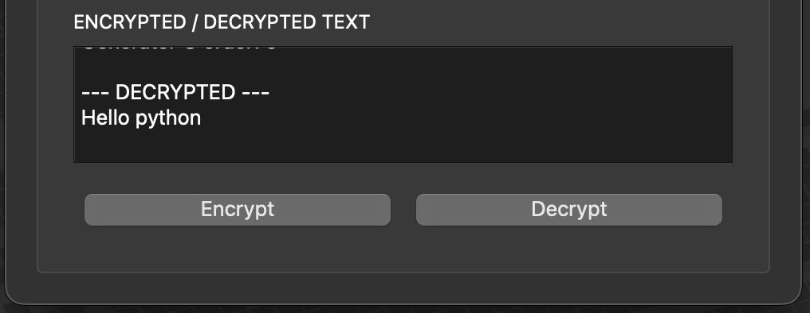

# Encryption and Decryption Tool using Elliptic Curve Cryptography



## 1. Overview

This tool provides a secure, user-friendly graphical interface for encrypting and decrypting files. It demonstrates a powerful **hybrid encryption system** that combines the strengths of both asymmetric (public-key) and symmetric cryptography.

The application leverages **Elliptic Curve Cryptography (ECC)**, a modern and highly efficient form of public-key cryptography, to establish a secure shared secret between two parties. This secret is then used as a key for the **Advanced Encryption Standard (AES)**, a fast and secure symmetric encryption algorithm, to encrypt and decrypt file content.

This project is ideal for anyone interested in applied cryptography, secure communications, or the practical implementation of ECC and AES.

---

## 2. How It Works: A Hybrid Encryption Approach

The tool's security is built on a two-stage process that ensures both secure key exchange and fast data encryption.

### Stage 1: Secure Key Exchange with Elliptic Curve Diffie-Hellman (ECDH)

The most critical challenge in cryptography is securely sharing an encryption key. This tool solves it using **Elliptic Curve Diffie-Hellman (ECDH)**.

1.  **Setup**: Two parties, Alice and Bob, agree on public Elliptic Curve parameters: a specific curve equation (`y² = x³ + ax + b`), a prime modulus (`q`), and a generator point (`G`). These are all public knowledge.
2.  **Key Generation**:
    * Alice chooses a secret random number, `privA` (her private key), and calculates her public key: `pubA = privA * G`.
    * Bob does the same, choosing `privB` and calculating `pubB = privB * G`.
3.  **Key Exchange**: They exchange their public keys (`pubA` and `pubB`) over an insecure channel.
4.  **Shared Secret Calculation**:
    * Alice calculates the shared secret: **`S = privA * pubB`**.
    * Bob calculates the shared secret: **`S = privB * pubA`**.

Because of the mathematical properties of elliptic curves, both Alice and Bob arrive at the **exact same point `S`**. An attacker who intercepts their public keys cannot compute `S` without knowing one of their private keys, which is computationally infeasible.

### Stage 2: Data Encryption with AES

Once the secure shared secret `S` is established, it's used to create a key for a symmetric cipher.

1.  **Key Derivation**: The x-coordinate of the shared secret point `S` is passed through a **SHA-256 hash function**. This produces a robust, fixed-size 256-bit key suitable for AES.
2.  **Symmetric Encryption**: The derived key is used with the **Advanced Encryption Standard (AES)** in ECB mode to encrypt the contents of the imported file. AES is extremely fast and is the worldwide standard for encrypting bulk data.
3.  **Decryption**: The recipient performs the same ECDH key exchange to derive the identical AES key, which they can then use to decrypt the ciphertext back into the original plaintext.

This hybrid model gives us the best of both worlds: the high security of asymmetric cryptography for key exchange and the high speed of symmetric cryptography for data encryption.

---

## 3. Features

* **Secure Hybrid Encryption**: Implements the ECDH protocol for key exchange and AES-256 for data encryption.
* **User-Friendly GUI**: A simple and intuitive interface built with Python's PyQt5 library.
* **Customizable Crypto Parameters**: Allows advanced users to define their own elliptic curve equation parameters (`a`, `b`, and prime `q`).
* **File I/O**: Easily import any file for encryption and save the output as `Encrypted.txt` or `Decrypted.txt`.
* **Educational**: Serves as a clear, practical demonstration of modern cryptographic principles.

---

## 4. Project Structure & Setup

For the images in this guide to load correctly, you must create a folder named `images` in the same directory as the Python scripts (`gui.py`, `eclib.py`).

Your project folder should look like this:

```
/your-project-folder
|-- gui.py
|-- eclib.py
|-- README.md
|-- images/
|   |-- gui_screenshot.png
|   |-- import_file.png
|   |-- encryption_process.png
|   |-- decryption_process.png
```

You will need to create your own screenshots and name them as listed above.

---

## 5. Prerequisites & Installation

Before running the application, ensure you have the following installed.

* **Python 3**: Download from [python.org](https://www.python.org/downloads/).
* **PyQt5**: A Python binding for the Qt GUI toolkit. Install it via pip:
    ```bash
    pip install PyQt5
    ```
* **pycryptodome**: A powerful, self-contained Python cryptographic library.
    ```bash
    pip install pycryptodome
    ```

---

## 6. How to Run the Application

1.  **Download the Files**: Clone the repository or download the source code, ensuring that `gui.py` and `eclib.py` are in the same directory.
2.  **Create Image Folder**: Create the `images` folder as described in the "Project Structure & Setup" section.
3.  **Open a Terminal**: Navigate to the directory containing the project files using your command line or terminal.
    ```bash
    cd path/to/your/project/folder
    ```
4.  **Execute the Script**: Run the main GUI file using Python.
    ```bash
    python gui.py
    ```
5.  The application window will launch.

---

## 7. Step-by-Step Usage Guide

### Step 1: Set Cryptographic Parameters

The application window opens with default parameters for an elliptic curve and private keys for two simulated parties, A and B.

* **Elliptic Curve Equation**: The default is `y² = x³ + 2x + 3 (mod 97)`. You can change the values of `a`, `b`, and the prime `q`.
* **Private Keys**: Enter the private keys for Party A and Party B.
    * **IMPORTANT**: For the cryptography to work, the private keys must be integers that are **less than the order of the generator point G**. For the default curve, the order of G is 5, so the private keys must be 1, 2, 3, or 4. The application will print the order for you when you run an operation.

### Step 2: Import a File for Encryption

Click the **"Import File"** button. This opens your system's file explorer, allowing you to browse and select the file you wish to encrypt. The application does not have a separate input form for the file path; all file selection is handled through this dialog.

Once you select a file, its contents are loaded into the application and displayed in the main text area.



### Step 3: Encrypt the File

Click the **"Encrypt"** button.

1.  **ECDH Exchange (Alice's side)**: The tool simulates Party A calculating the shared secret using its private key (`PrivA`) and Party B's public key.
2.  **AES Encryption**: The file's content is encrypted using the derived AES key.
3.  **Output**: The encrypted text (encoded in Base64 for easy handling) appears in the text area and is automatically saved to a file named `Encrypted.txt` in the same directory.



### Step 4: Decrypt the File

1.  **Load Ciphertext**: Use the **"Import File"** button to load an encrypted file (e.g., `Encrypted.txt`).
2.  **Click Decrypt**: Click the **"Decrypt"** button.
3.  **ECDH Exchange (Bob's side)**: The tool simulates Party B calculating the shared secret using its private key (`PrivB`) and Party A's public key. Since the math works out, this is the *same secret* Party A calculated.
4.  **AES Decryption**: This secret is used to derive the correct AES key to decrypt the ciphertext.
5.  **Output**: The original plaintext is restored and displayed in the text area. It is also saved to a file named `Decrypted.txt`.



---
*For a detailed theoretical explanation of the cryptographic concepts used in this tool, please refer to the original `README.md` file included in the repository.*
